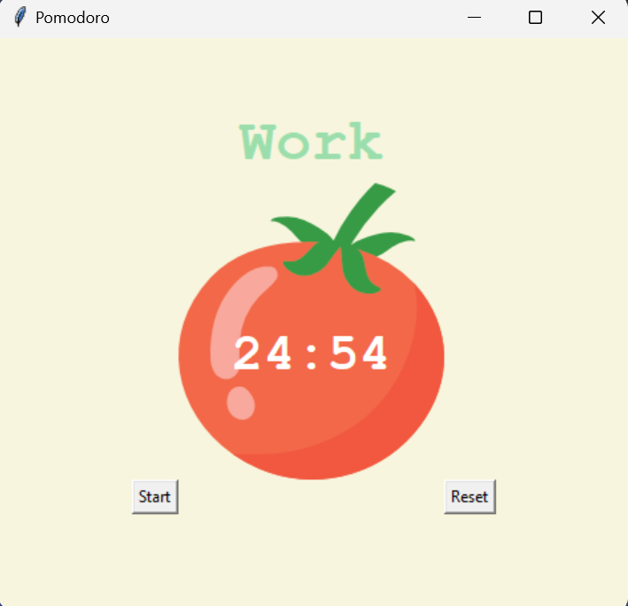

# Pomodoro Timer

A simple Pomodoro timer application built using Python's Tkinter library.

## Features

- Set work duration for 25 minutes.
- Short break of 5 minutes after each work session.
- Long break of 20 minutes after every 4 work sessions.
- Displays countdown timer and current session type (Work/Break).
- Keeps track of completed sessions with checkmarks.

## How to Use

1. Run the `main.py` script.
2. Click the "Start" button to begin the Pomodoro timer.
3. Click the "Reset" button to reset the timer and session count.

## Requirements

- Python 3.x
- Tkinter library

## Installation

No installation required. Simply clone the repository and run the `pomodoro.py` script.

```bash
git clone https://github.com/amnullh/Pomodoro-Timer.git
cd pomodoro
python main.py
```

## Screenshots


